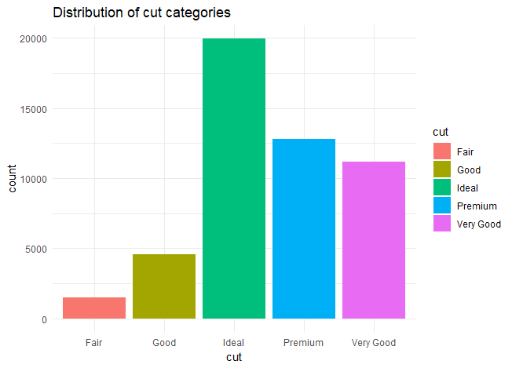

# A\_\_Diamond_Data_driven-Analysis_using-R_programming

Aims to create predictive models to understand how various factors influence the price of diamond,showing the correlation between two factors that could be affecting the diamond.

While delving into the Dataset, our initial examination involves the following aspects:

1.  Determining the data type of each column.

2.  Assessing the dimensions of the dataset, including the number of rows and columns.

3.  Analyzing the number or percentage of missing values within the dataset.

4.  Generating a descriptive summary, including statistical information, to gain an overall understanding of the dataset.

we also looked at analytical Questions for Data Examination:

1.  **Carat Weight Distribution and Price Correlation:**

    -   What is the distribution pattern of carat weights within the dataset, and is there a discernible correlation between carat weight and the price of diamonds?

2.  **Price Distribution Across Cut Categories:**

    -   How are diamond prices distributed among various cut categories? Is there a significant variance in pricing based on different cut classifications?

3.  **Trend Analysis: Depth Percentage vs. Price:**

    -   Is there a noticeable trend or relationship between the depth percentage of diamonds and their corresponding prices? How does depth percentage impact the pricing dynamics?

4.  **Optimal Cut, Color, and Clarity for High Average Price:**

    -   Among the combinations of cut, color, and clarity, which tends to yield the highest average price for diamonds? Are there specific attributes that consistently contribute to higher pricing?

5.  **Outlier Detection and Impact on Price Distribution:**

    -   Are there any outliers within the dataset, and how do they influence the overall distribution of diamond prices? Understanding the impact of outliers on pricing dynamics is crucial for a comprehensive analysis.

## Data Exploration

## Distribution of cut categories

{width="728"}
